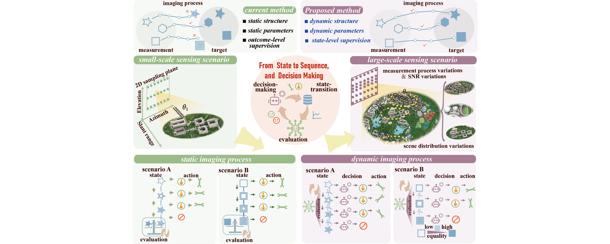

# DynDecision-ArraySAR

In this work, as shown above, we propose a dynamic decision-making framework for array-SAR imaging. Unlike conventional approaches that rely on static structures, fixed parameters, and outcome-level supervision, our method introduces dynamic structures and parameters guided by state-level supervision, enabling adaptive processing across diverse measurement conditions. The imaging process is reformulated from a static pipeline into a Markov decision process, where the decision-making module selects actions according to the current state, the state-transition module updates the state, and the evaluation module provides feedback on both states and actions. Through this perspective of "from states to sequence, and decision making," the framework advances array-SAR imaging from rigid fixed flows toward adaptive and scenario-specific imaging. This shift allows the proposed method to generalize better for large-scale sensing of diverse scenarios.

---

## 📖 How to access?

Our research team maintains specific guidelines for sharing our primary code and associated datasets. For the baseline methods, code would be avaiable without requiremetns and for the primal code,
To obtain access to the code, please complete and sign the required agreement, then email the scanned document to xdma@std.uestc.edu.cn or zhanxu@std.uestc.edu.cn.

## 📝 Note

Currently, this work is under review, and the associated agreement document will be made available soon.

## ✅ Done

- We have provided the StatFilter implementation for the near-field sensing scenario using a prototype ground-based array-SAR system. This method represents the static matched filtering approach, a foundational technique in array-SAR imaging. In this paradigm, reconstruction is achieved directly through a fixed analytical operator, without utilizing any prior knowledge of the scene.

## 🔜 TODO
Due to the ongoing review process, the code, particularly those related to deep learning-based methods, is not yet available for open-source distribution. It still requires finalization, refinement, and thorough documentation. The following tasks are still in progress before the code can be made available:
- Finalize the data preprocessing code for the far-field sensing scenario.
- Finalize the baseline learning-based methods.
- Finalize the primary code for the proposed method.

## 🙏 Acknowledgements

This study involves two publicly available datasets for near-field and far-field array-SAR sensing scenarios. For the near-field scenario, the **3DREID** dataset, which was released by our research team, is used. For the far-field scenario, we express our special gratitude to Prof. Qiu and Prof. Ding at the Aerospace Information Research Institute, Chinese Academy of Sciences, Beijing, China, as well as other researchers who contributed to making the **SARMV3D** dataset publicly available. 

For further details on the datasets, please refer to the respective citations:  
- **3DREID Dataset**: [3DRIED: A High-Resolution 3-D Millimeter-Wave Radar Dataset Dedicated to Imaging and Evaluation
](https://www.mdpi.com/2072-4292/13/17/3366)
- **SARMV3D Dataset**: [SAR Microwave Vision-based 3D Imaging Research Dataset](https://radars.ac.cn/web/data/getData?dataType=SARMV3D_en&pageType=en)

