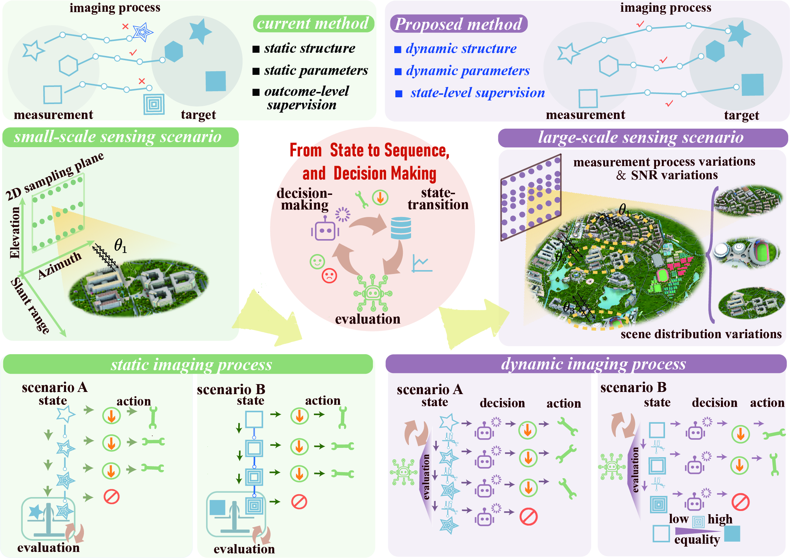

# DynDecision-ArraySAR



Dynamic Decision Array-SAR reformulates 3D radar imaging as a Markov decision process, 
replacing static reconstruction with a state–sequence–decision framework. 
Adaptive actions and evaluation-guided feedback enable robust, scenario-adaptive imaging 
across noise levels, measurement models, and scene distributions.

---

## 📖 Description
This repository contains the **MATLAB implementation** of our paper:  

**Beyond Static Imaging: A Dynamic Decision Paradigm for Robust Array-SAR in Diverse Sensing Scenarios**

Currently, we provide the **StatFilter** implementation, denoting the static matched filtering method.  
This represents the earliest paradigm in array-SAR imaging, where the reconstruction is directly obtained via a fixed analytical operator, without leveraging any prior knowledge of the scene.


---

## ⚙️ Features
- Uses output_rawdata.mat (download from cloud link)
- Implements StatFilter (static matched filtering paradigm)
- Generates reconstruction results via fixed analytical operator
- Supports dB visualization with configurable clipping ranges

---

## ▶️ Usage
1. Clone the repository:
   ```bash
   git clone https://github.com/KB504-public/DynDecision-ArraySAR.git
   cd DynDecision-ArraySAR

---

## 🔜 TODO
- Add decision-making module code (state–sequence–decision framework)
- Add training and evaluation scripts
- Provide sample dataset generator for testing
- Add Python implementation 

---

## 📜 License
This repository is **not open source**.  
All rights are reserved by the author.  
Use, modification, distribution, or commercial applications are **prohibited without explicit written permission**.  

For licensing requests, please contact: *your.email@domain*  

---


